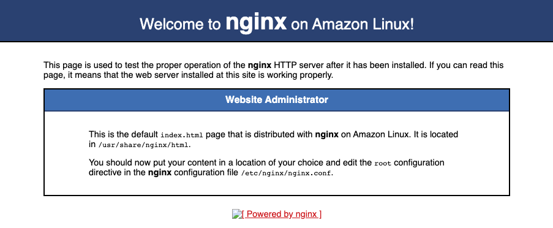

# deploy-react-auth0
instructions to deploy a react app, [react-auth0-login](https://github.com/jimareed/react-auth0-login), to AWS.


## Setup

### 1. Provision AWS VM
- Login to AWS Management Console, select EC2 and select `Launch Instance`.
- Select `Amazon Linux` (default instance type) and select `Review and Launch`, then select `Launch`
- Note the Public IPv4 address

### 2. Configure Domain
1. Start your Domain Manager (e.g., GoDaddy) and select the domain that you want to map to your VM
2. Map your domain to the IPv4 address of the AWS VM

### 3. Install Nginx & Docker
- login to your VM and install nginx & docker
```
ssh -i "--SSH Key File--" --VM IP Address-- -l ec2-user
sudo -i
yum update
yum install docker
service docker start
amazon-linux-extras install nginx1.12
service nginx start
```
- test nginx:
```
curl localhost
```
This should return an NGINX html page

### 4. Set Inbound Security Rules
- from the AWS EC2 Dashboard, select your VM Instance and select the Security tab
- select your Security groups, select `Edit inbound rules`
- add the following rules:
  - HTTP, source Anywhere
  - HTTPS, source Anywhere

### 5. Test NGINX
open your domain in a browser, should see the nginx default page (with a not secure warning)
<p  align="center">
    
</p>

### 6. Build and run react-auth0-login locally
Verify in your development environment before deploying to the VM. Follow the instructions in [react-auth0-login](https://github.com/jimareed/react-auth0-login) to configure the auth0 application and build and run the react app.

